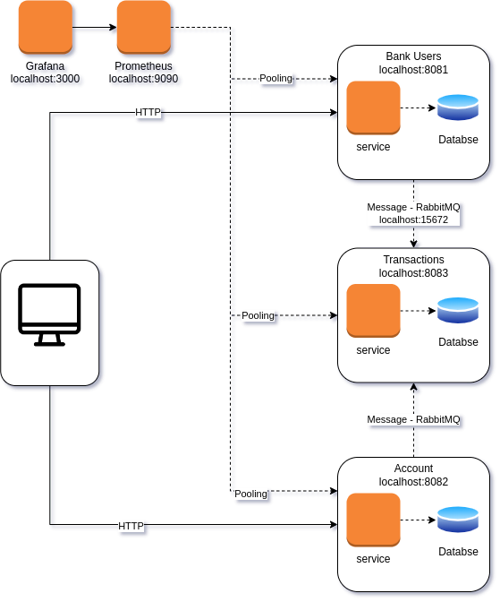

# Matthew Bank Project

This project uses Quarkus, the Supersonic Subatomic Java Framework.

If you want to learn more about Quarkus, please visit its website: https://quarkus.io/ .

## The project
The goal of this project is to simulate a simple bank. In this project we have three services: `user-service`, `account-service` and `transaction-service`.

These services communicate with each other using HTTP Requests. 

Each bank user can have one or more Account.

The user can do the following operations in the account:

- Deposit
- Transfer
- Withdraw

A simple architecture of this project is shown below: 



## TODOs

- [ ] Change the transaction-service to use RabbitMQ instead of HTTP
- [ ] Add Grafana to use with Prometheus
- [ ] Create a simple interface
- [ ] Improve the database use
- [ ] Add Unit Tests and Integration Tests


## Starting the infrastructure

This project uses a couple of services, such as Prometheus and Postgres. You can start them using the `docker-compose.yaml`, located in the `infrastructure` folder:

```bash
$ cd infrastructure
$ docker-compose up -d
```

You can stop them using:
```bash
$ docker-compose down
$ docker-compose rm
```

## Running the application in dev mode

You can run your application in dev mode that enables live coding using:

```bash
$ ./gradlew account-service:quarkusDev
$ ./gradlew user-service:quarkusDev
$ ./gradlew transaction-service:quarkusDev
```

> **_NOTE:_** The Quarkus Dev UI is available in dev mode at `http://localhost:{port}/q/dev/`
> 
> 
> **_NOTE 2:_** The Swagger UI and OpenAPI Documentation is available in dev mode at `http://localhost:{port}/q/swagger-ui/`

## Ports

Each application are accessible on its own port:
* User Service: 8081 (http://localhost:8081)
* Account Service: 8082 (http://localhost:8082)
* Transaction Service: 8083 (http://localhost:8083)
* Prometheus: 9090 (http://localhost:9090)
* Postgres: 5432 (http://localhost:5432)


## Packaging and running the application

The application can be packaged using:

```bash
$ ./gradlew account-service:build -x test
$ ./gradlew user-service:build -x test
$ ./gradlew transaction-service:build -x test
```

It produces the `quarkus-run.jar` file in the `build/quarkus-app/` directory.
Be aware that it’s not an _über-jar_ as the dependencies are copied into the `build/quarkus-app/lib/` directory.

The application is now runnable using `java -jar build/quarkus-app/quarkus-run.jar`.

If you want to build an _über-jar_, execute the following command:

```bash
$ ./gradlew build -Dquarkus.package.type=uber-jar -x test
```

The application, packaged as an _über-jar_, is now runnable using `java -jar build/*-runner.jar`.

## Building and Running inside Docker
After packing the application, you can build the docker image running the following commands:

- To build a Account Service Docker Image and run the docker container:
```bash
$ cd account-service
$ docker build -f src/main/docker/Dockerfile.jvm -t quarkus/account-service-jvm .
$ docker run -i --rm --net=host -p 8080:8080 quarkus/account-service-jvm
```

- To build a User Service Docker Image and run the docker container:
```bash
$ cd user-service
$ docker build -f src/main/docker/Dockerfile.jvm -t quarkus/user-service-jvm .
$ docker run -i --rm --net=host -p 8080:8080 quarkus/user-service-jvm
```

- To build a Transaction Service Docker Image and run the docker container:
```bash
$ cd transaction-service
$ docker build -f src/main/docker/Dockerfile.jvm -t quarkus/transaction-service-jvm .
$ docker run -i --rm --net=host -p 8080:8080 quarkus/transaction-service-jvm
```

## Related Guides

- RESTEasy Reactive ([guide](https://quarkus.io/guides/resteasy-reactive)): A JAX-RS implementation utilizing build time
  processing and Vert.x. This extension is not compatible with the quarkus-resteasy extension, or any of the extensions
  that depend on it.
- Kotlin ([guide](https://quarkus.io/guides/kotlin)): Write your services in Kotlin

## Provided Code

### RESTEasy Reactive

Easily start your Reactive RESTful Web Services

[Related guide section...](https://quarkus.io/guides/getting-started-reactive#reactive-jax-rs-resources)
